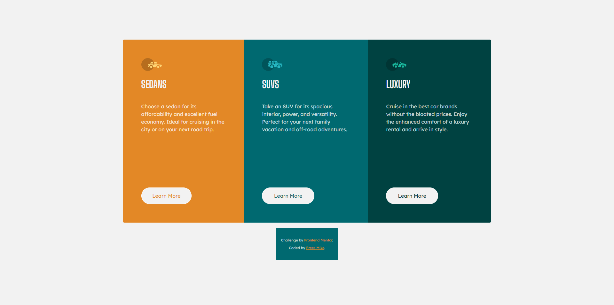

# Frontend Mentor - 3-column preview card component solution

This is a solution to the [3-column preview card component challenge on Frontend Mentor](https://www.frontendmentor.io/challenges/3column-preview-card-component-pH92eAR2-). Frontend Mentor challenges help you improve your coding skills by building realistic projects. 

## Table of contents

- [Overview](#overview)
  - [The challenge](#the-challenge)
  - [Screenshot](#screenshot)
  - [Links](#links)
- [My process](#my-process)
  - [Built with](#built-with)
  - [What I learned](#what-i-learned)
  - [Continued development](#continued-development)
- [Author](#author)

**Note: Delete this note and update the table of contents based on what sections you keep.**

## Overview

### The challenge

Users should be able to:

- View the optimal layout depending on their device's screen size
- See hover states for interactive elements

### Screenshot

### Links

- [Solution URL](https://github.com/mikeFrees/3-column-preview-card-component-main)
- [Live Site URL](https://mikefrees.github.io/3-column-preview-card-component-main/)

## My process

### Built with

- Semantic HTML5 markup
- CSS custom properties
- Flexbox
- CSS Grid
- Sass/Scss
- Npm
- AutoPrefixer
- Normalize.css

### What I learned

I aquired a deeper understanding of how to use Npm and started learning about grunt. 

I also learned how to import and use fonts via npm but ran into a problem with my deployment on github pages. I exluded the files from the node_modules folder to avoid encumbering my repo with all the dependencies but i did not realize that by doing this my files would no longer have acces to the ressources they needed(font files and normalize.css).

I also have a better understanding of how to write scss and how to use the css pseudo classes and elements.

### Continued development

For my next project i would like to set up a good development proces with grunt and understand how to build a gruntfile. And start looking into Typescript because the type declartation makes me think of when i used to programm in c# which makes me feel confortable.

## Author

- LinkedIn - [Frees Mike](https://www.linkedin.com/in/mike-frees/)
- Frontend Mentor Profile - [Mike Frees](https://www.frontendmentor.io/profile/mikeFrees)
